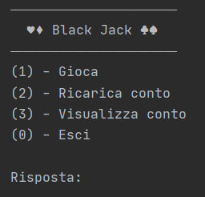
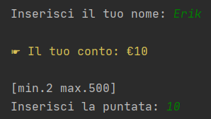
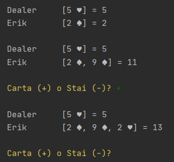
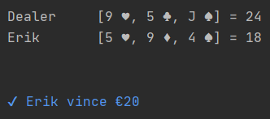
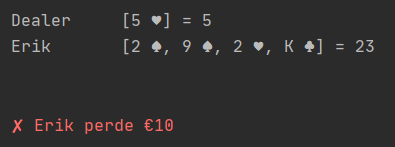

# Blackjack Console Game 
This is a console-based implementation of the popular casino game Blackjack with an improved CLI graphics system.

## Getting Started
### Prerequisites
You will need to have Java 8+ installed on your computer to run this game.

### Installation
1. Clone or download this repository to your local machine.
2. Navigate to the project directory.
3. Compile the `Main.java` file by running the command `javac Main.java` in the terminal.
4. Run the game by entering the command `java Main` in the terminal.

## The Game
When you start the game the following menu appears on the home screen

>Type a number in the menu to continue

### Options available
  * Type '1' to start playing, put your name and place the bet
  * Type '2' to restore your money to the default initial value (10), when you don’t have the money to play
  * Type '3' to see your amount of money
  * Type '0' to exit

### Place the bet

After choosing, you will be asked the name (only 1 time) and bet for the game. 
The bet may not exceed your money or the maximum allowed by the game (500), same thing for the minimum bet (2).

### Cards distribution

From the shuffled deck, the dealear deals the player two cards and finally takes only one card, European style. 
Once the distribution is over, the player chooses whether to draw another card (+) or stop (-). 

Once the player has decided to stop, it is up to the dealer to draw, the latter does not stop until he has drawn or passed the player.

### The result
At the end of the game there are three possibilities: 
- When the dealer "busts", that is, exceeds the maximum limit of 21 and consequently the player win the double of the initial bet.
- When the player "busts" or is passed by the dealer. The player loses all the initial bet.
- When the player and the dealer get the same score without "getting high". The initial bet is refunded.

 

 

### Feedback
If you have any feedback, please reach out to us at gurzau10@gmail.com

### License
[MIT](https://choosealicense.com/licenses/mit/)
